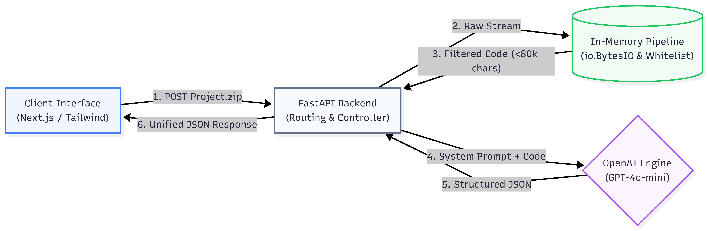
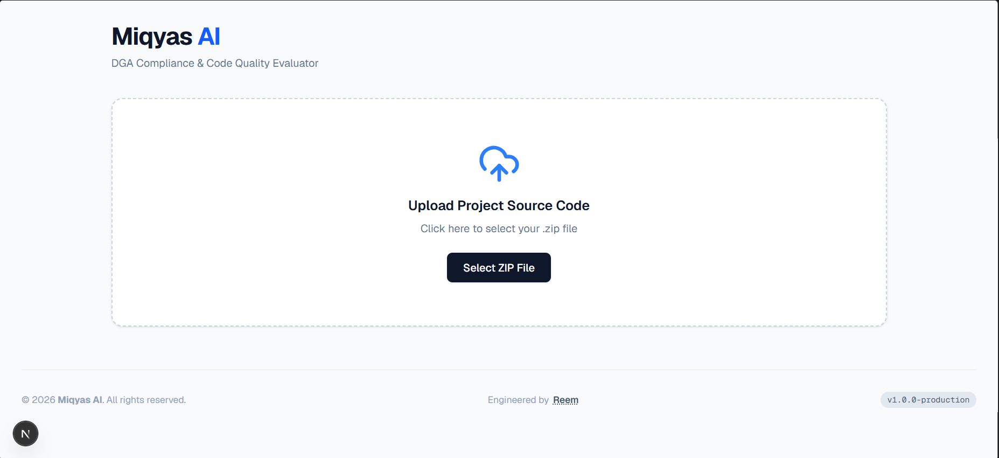
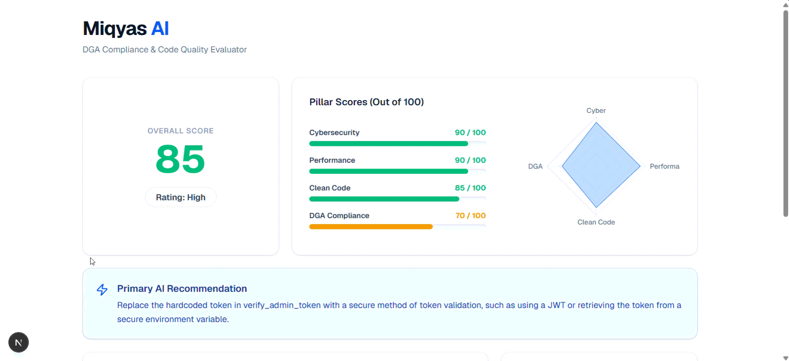
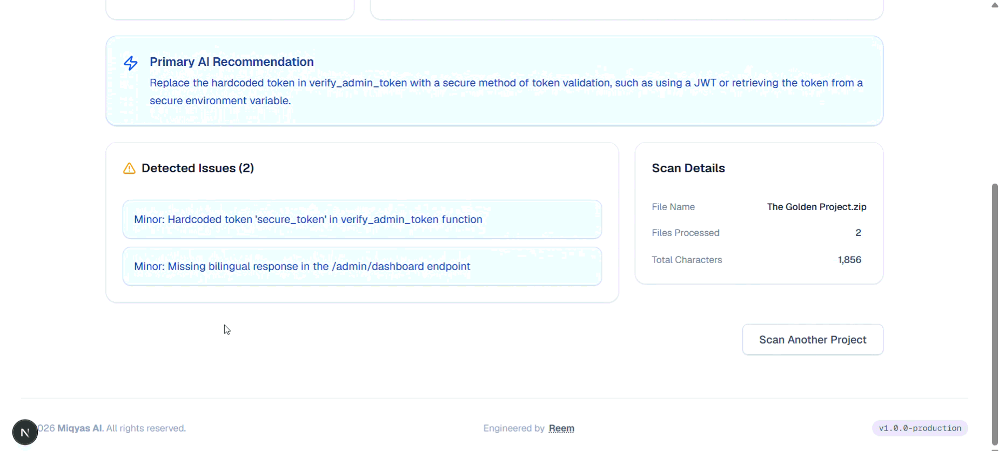

# Miqyas AI

### Automated Static Code Analysis & DGA Compliance Evaluator for Saudi Government Applications

Miqyas AI is an LLM-powered static code analysis system designed to evaluate software repositories before deployment in Saudi government environments.

It combines AI-assisted source-code analysis with deterministic scoring and localized DGA/NDMO compliance rules to provide a structured assessment of software readiness.

---

## Overview

Miqyas evaluates submitted source-code repositories across four weighted dimensions:

| Evaluation Pillar | Weight |

|---|---:|

| Cybersecurity | 30% |

| Software Performance | 25% |

| Clean Code & Architecture | 25% |

| DGA / NDMO Compliance | 20% |

The system identifies potential issues, calculates pillar scores, applies mandatory security and compliance rules, and returns structured evaluation results with actionable recommendations.

---

## Key Features

- AI-powered static source-code analysis

- Saudi-specific DGA and NDMO compliance evaluation

- Cybersecurity and performance analysis

- Clean-code and architecture assessment

- Deterministic weighted scoring

- Mandatory security and compliance override rules

- Structured JSON responses

- Secure in-memory repository extraction

- 20 MB upload limit

- 80,000-character evaluation budget

- Interactive evaluation dashboard

---

## Architecture

**Analysis pipeline:**

Source Repository

       ↓

Next.js Frontend

       ↓

FastAPI Backend

       ↓

In-Memory Extraction \& Filtering

       ↓

OpenAI GPT-4o

       ↓

Structured JSON Evaluation

       ↓

Weighted Scoring \& Override Rules

       ↓

Results Dashboard

AI \& Scoring

Miqyas uses OpenAI's:

gpt-4o-2024-08-06

The model is guided by a constraint-driven system prompt containing the evaluation criteria, scoring requirements, and Saudi-specific compliance rules.

The model runs with:

temperature=0.0

and returns structured JSON:

response\_format={"type": "json\_object"}

The overall score is calculated using:

Overall Score =

0.30 أ— Cybersecurity

+ 0.25 أ— Performance

+ 0.25 أ— Clean Code

+ 0.20 أ— DGA Compliance

Miqyas also uses deterministic Mandatory Override Rules to prevent critical security or compliance failures from being hidden by a high weighted average.

Evaluation Results

Miqyas was evaluated using a custom Golden Dataset of 59 manually engineered code samples.

Metric	Result

Rating Accuracy	91.5%

Score Accuracy	93.2%

Golden Dataset	59 samples

Analysis Time	8–14 seconds

Screenshots

Repository Upload

Evaluation Dashboard

Detailed Findings

Technology Stack

Frontend

Next.js

React

TypeScript

Tailwind CSS

Recharts

Backend

Python

FastAPI

Uvicorn

python-multipart

AI \& Data

OpenAI API

GPT-4o

Prompt Engineering

Structured JSON

JSON / JSONL

Project Structure

MiqyasProjectFinal/

│

├── miqyas.py

├── miqyas\_api/

│   ├── analyzer.py

│   ├── extractor.py

│   ├── main.py

│   ├── prompt.py

│   └── requirements.txt

│

├── miqyas-ui/

├── docs/

│   └── images/

│       ├── architecture.png

│       ├── upload-interface.png

│       ├── results-dashboard.png

│       └── results-details.png

│

├── miqyas\_test\_public.jsonl

├── miqyas\_evaluation\_results\_public.txt

├── system\_prompt.txt

├── requirements.txt

└── README.md

Running Locally

Backend

Install the backend dependencies:

pip install -r miqyas\_api/requirements.txt

Create:

miqyas\_api/.env

and add your OpenAI API key:

OPENAI\_API\_KEY=your\_api\_key\_here

Start the API:

uvicorn miqyas\_api.main:app --reload

Frontend

cd miqyas-ui

npm install

npm run dev

Security

Miqyas includes several safeguards when processing uploaded repositories:

In-memory ZIP extraction

Repository size limitation

Source-code character budget

Supported-extension whitelist

Exclusion of dependency directories and .env files

Environment-based API key management

API keys and environment files are intentionally excluded from the repository.

Future Work

Future development directions include:

Dynamic Application Security Testing (DAST)

Sandboxed runtime analysis

Cross-file data-flow analysis

CI/CD integration

GitHub Actions integration

Pull-request compliance gates

Academic Project

Miqyas AI was developed as a Computer Science graduation project at Umm Al-Qura University.

Author: Reem Alwafi

Department: Computer Science

Date: June 2026

